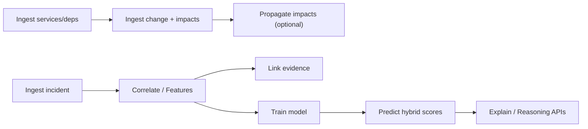

# BUSINESS_LOGIC_AUDIT.md

**Scope:** All SQL in migrations and embedded queries in Python modules  
**Architecture:** SQL-First schema, Python-embedded business logic via psycopg2

---

## Pattern Inventory

| Pattern | Found? | Location |
|---------|--------|----------|
| MERGE | No | — |
| UPSERT (`ON CONFLICT`) | Yes (1) | `service_ingestor.py` |
| Complex JOIN chains | Yes (moderate) | API read endpoints, context builder, explain |
| Dynamic SQL | No | — |
| Reporting queries | Yes | List/read APIs, explain/reasoning endpoints |
| Stored procedures/functions | No (DB) | Logic in Python modules |

---

## 1. Service Catalog Ingestion (UPSERT)

**File:** `backend/app/ingestion/service_ingestor.py`

| Field | Detail |
|-------|--------|
| **Business objective** | Load service metadata from YAML files into `services` table idempotently |
| **Inputs** | Files under `app/sample_repo/*/service.yaml` (`name`, `owner_team`, `criticality`) |
| **Outputs** | Rows in `services`; duplicates skipped via `ON CONFLICT (name) DO NOTHING` |
| **Dependencies** | `services` table (`name UNIQUE`), filesystem YAML |
| **Risks** | Hardcoded `REPO_PATH`; no update path for changed metadata; silent skip on invalid YAML |

```sql
INSERT INTO services (name, owner_team, criticality)
VALUES (%s, %s, %s)
ON CONFLICT (name) DO NOTHING
```

---

## 2. Dependency Graph Ingestion

**File:** `backend/app/ingestion/dependency_ingestor.py`

| Field | Detail |
|-------|--------|
| **Business objective** | Build service-to-service dependency edges from YAML `depends_on` |
| **Inputs** | `service.yaml` files, existing `services` rows |
| **Outputs** | Rows in `dependencies` (`source_type='service'`, `target_type='service'`) |
| **Dependencies** | `services`, `dependencies` tables |
| **Risks** | **`dependency_type` never set (NULL)** — breaks `graph_traversal.py` filter. No dedup constraint → duplicate edges on re-ingest. Missing services silently skipped |

```sql
INSERT INTO dependencies (source_type, source_id, target_type, target_id)
VALUES ('service', %s, 'service', %s)
```

---

## 3. Change Ingestion + Direct Impact Recording

**File:** `backend/app/ingestion/change_ingestor.py`

| Field | Detail |
|-------|--------|
| **Business objective** | Record a deployment/PR change and mark directly touched services as high impact |
| **Inputs** | `change_type`, `description`, `git_ref`, `services_touched[]` |
| **Outputs** | `changes` row + `change_impacts` rows (`impact_level='high'`) |
| **Dependencies** | `changes`, `services`, `change_impacts` |
| **Risks** | Unknown service names silently ignored. Propagation is a separate manual API call |

---

## 4. Change Impact Propagation (BFS Graph Walk)

**File:** `backend/app/ingestion/impact_propagator.py`

| Field | Detail |
|-------|--------|
| **Business objective** | Expand blast radius: propagate medium/low impact to downstream dependent services |
| **Inputs** | `change_id`; starting nodes = services with `impact_level='high'` |
| **Outputs** | Additional `change_impacts` rows (depth 0 → `medium`, deeper → `low`) |
| **Dependencies** | `change_impacts`, `dependencies` (service→service edges only) |
| **Risks** | No dedup on INSERT → re-running creates duplicates. Does not filter `dependency_type`. N+1: one SELECT + one INSERT per BFS node |

```sql
SELECT source_id FROM dependencies
WHERE target_id = %s AND source_type = 'service' AND target_type = 'service'
```

---

## 5. Incident Ingestion

**File:** `backend/app/ingestion/incident_ingestor.py`

| Field | Detail |
|-------|--------|
| **Business objective** | Create incident and link affected services |
| **Inputs** | `title`, `severity`, `started_at`, `affected_services[]` |
| **Outputs** | `incidents` row + `incident_entities` rows |
| **Dependencies** | `incidents`, `services`, `incident_entities` |
| **Risks** | Unknown service names silently dropped. No dedup on entity links |

---

## 6. Rule-Based Incident–Change Correlation (Core RCA)

**File:** `backend/app/ingestion/incident_change_correlator.py`

| Field | Detail |
|-------|--------|
| **Business objective** | Score candidate changes within a 24h pre-incident window and persist ranked hypotheses |
| **Inputs** | `incident_id` → incident start time, affected services (expanded downstream via graph) |
| **Outputs** | `root_cause_hypotheses` rows (`change_id`, `confidence`, templated `description`) |
| **Dependencies** | `incidents`, `incident_entities`, `changes`, `change_impacts`, `evidence`, `graph_traversal` |
| **Risks** | **Time window bug:** no upper bound — includes post-incident changes. **Evidence boost broken:** reference format mismatch. Hardcoded scoring weights. DELETE-then-INSERT loses audit history |

**Key SQL:**

```sql
-- Candidate changes (missing upper bound vs feature_builder)
SELECT id FROM changes WHERE created_at >= %s

-- Evidence count (reference format mismatch — never matches)
SELECT COUNT(*) FROM evidence
WHERE incident_id = %s AND source_type = 'change' AND reference = %s
-- Expects: 'Change {change_id}'
-- Actual:  'Deployment {git_ref} at {created_at}'
```

**Scoring Logic (Python):**

| Impact Level | Weight |
|-------------|--------|
| high | 0.7 |
| medium | 0.4 |
| low | 0.2 |

Evidence boost: `min(0.2, evidence_count * 0.1)`

---

## 7. ML Feature Engineering

**File:** `backend/app/ml/feature_builder.py`

| Field | Detail |
|-------|--------|
| **Business objective** | Build training/inference features linking incidents to candidate changes |
| **Inputs** | `incident_id`; 24h window `[incident_start - 24h, incident_start]` |
| **Outputs** | Rows in `incident_change_features` |
| **Dependencies** | Same tables as correlator + `services` criticality CASE |
| **Risks** | **Inconsistent time filter** vs correlator. N+1 queries per candidate. All labels default to 0 |

**Features Computed:**

| Feature | Computation |
|---------|-------------|
| `temporal_proximity` | `max(0, 1 - hours_diff/24)` |
| `service_overlap` | Count of overlapping impacted/affected services |
| `graph_distance` | 0=direct overlap, 1=indirect, 2=weak |
| `criticality_score` | MAX CASE mapping: high=1.0, medium=0.6, low=0.3 |

```sql
SELECT id, created_at FROM changes
WHERE created_at BETWEEN %s AND %s  -- Correct upper bound
```

---

## 8. Downstream Service Graph Traversal

**File:** `backend/app/reasoning/graph_traversal.py`

| Field | Detail |
|-------|--------|
| **Business objective** | Expand incident blast radius to downstream callers/dependents |
| **Inputs** | Set of service UUIDs |
| **Outputs** | Expanded set including downstream services |
| **Dependencies** | `dependencies` table, `PROPAGATING_DEPENDENCIES` from settings |
| **Risks** | **Critical:** ingested dependencies have `dependency_type=NULL`, so filter returns empty for default data |

```sql
SELECT source_id FROM dependencies
WHERE target_id = ANY(%s::uuid[])
  AND dependency_type = ANY(%s)
```

---

## 9. Hybrid ML + Rule Prediction

**Files:** `backend/app/ml/predictor.py`, `backend/app/reasoning/hybrid_scorer.py`

| Field | Detail |
|-------|--------|
| **Business objective** | Rank change candidates by fusing rule confidence + ML probability |
| **Inputs** | `incident_change_features` JOIN `changes`; per-row lookup in `root_cause_hypotheses` |
| **Outputs** | Sorted prediction list with `hybrid_score`, `confidence_band`, `decision_trace` |
| **Dependencies** | Trained `model.joblib`, feature table, hypotheses table |
| **Risks** | `compute_hybrid_score` imported but **not used** — simpler fixed 0.6/0.4 weights applied instead. N+1 hypothesis lookups. Double DB connection in explain flow |

**Hybrid Formula (predictor.py):**

```
hybrid_score = 0.6 * rule_confidence + 0.4 * ml_probability
if graph_distance > 1: hybrid_score -= 0.1 * hybrid_score
```

---

## 10. ML Model Training

**File:** `backend/app/ml/train_model.py`

| Field | Detail |
|-------|--------|
| **Business objective** | Train logistic regression on labeled feature rows |
| **Inputs** | Full `incident_change_features` table |
| **Outputs** | `app/ml/model.joblib` + metrics |
| **Dependencies** | scikit-learn, feature table |
| **Risks** | All labels default to 0 — model cannot learn positive class. Requires ≥2 classes to train |

```sql
SELECT temporal_proximity, service_overlap, graph_distance, criticality_score, label
FROM incident_change_features
```

---

## 11. Evidence Linking

**File:** `backend/app/ingestion/evidence_linker.py`

| Field | Detail |
|-------|--------|
| **Business objective** | Attach deployment evidence to incidents from hypotheses |
| **Inputs** | `root_cause_hypotheses.change_id` → `changes.git_ref`, `created_at` |
| **Outputs** | `evidence` rows with reference `Deployment {git_ref} at {created_at}` |
| **Dependencies** | `root_cause_hypotheses`, `changes`, `evidence` |
| **Risks** | **Reference format mismatch** with correlator evidence boost |

---

## 12. Incident Context Assembly (Reporting)

**Files:** `backend/app/reasoning/context_builder.py`, `backend/app/api/explain.py`

| Field | Detail |
|-------|--------|
| **Business objective** | Assemble incident narrative context for reasoning/explanation APIs |
| **Inputs** | `incident_id` |
| **Outputs** | JSON context with metadata, services, candidates, evidence, hypotheses |
| **Dependencies** | 6+ tables via multiple JOINs |
| **Risks** | Duplicated query logic across two modules. Double DB connection per explain request |

**Representative JOIN:**

```sql
SELECT f.change_id, f.temporal_proximity, f.service_overlap,
       f.graph_distance, f.criticality_score,
       COALESCE(h.confidence, 0) AS rule_confidence
FROM incident_change_features f
LEFT JOIN root_cause_hypotheses h
  ON f.incident_id = h.incident_id AND f.change_id = h.change_id
WHERE f.incident_id = %s
```

---

## 13. Dependency Listing (Reporting)

**File:** `backend/app/api/dependencies.py`

| Field | Detail |
|-------|--------|
| **Business objective** | Human-readable dependency graph for dashboard/API |
| **Inputs** | None (full list) |
| **Outputs** | `{source, target, created_at}` per edge |
| **Dependencies** | `dependencies`, `services` (2 JOINs) |
| **Risks** | Assumes all deps are service→service. No pagination |

---

## 14. Change Impact Reporting

**File:** `backend/app/api/change_impact.py`

| Field | Detail |
|-------|--------|
| **Business objective** | List impacted services for a change, ordered by severity |
| **Inputs** | `change_id` |
| **Outputs** | Service names + impact levels |
| **Dependencies** | `change_impacts`, `services` |
| **Risks** | Duplicate impact rows from propagation re-runs inflate results |

---

## 15. RCA Guardrails & Confidence Bands

**Files:** `backend/app/reasoning/rca_guardrails.py`, `backend/app/reasoning/confidence_band.py`

| Field | Detail |
|-------|--------|
| **Business objective** | Clamp scores; flag weak signal (`hybrid < 0.55`) and close competition (`delta < 0.08`); map score to band |
| **Inputs** | Prediction list |
| **Outputs** | Cleaned scores, boolean flags, band labels (high/medium/low) |
| **Dependencies** | Used by `predictor.py`, `explain.py` |
| **Risks** | Thresholds hardcoded and scattered across modules |

---

## 16. GenAI Explanation

**File:** `backend/app/genai/explainer.py`

| Field | Detail |
|-------|--------|
| **Business objective** | Produce human-readable RCA narrative |
| **Inputs** | Assembled context from `explain.py` |
| **Outputs** | Markdown explanation string |
| **Dependencies** | Groq client initialized but **`client` never called** — returns hardcoded template |
| **Risks** | Requires `GROQ_API_KEY` at import but doesn't use LLM. Docs claim "AI-assisted explanation" |

---

## End-to-End RCA Pipeline



**Orchestration gap:** No single workflow ties correlate → features → evidence → train → predict. Each step is a separate POST endpoint.

---

## SQL Location Index

| Path | Role |
|------|------|
| `migrations/versions/initial_schema.sql` | Core DDL |
| `migrations/versions/add_feature_columns.sql` | Current feature table |
| `migrations/versions/incident_change_features.sql` | Superseded feature table |
| `ingestion/*.py` | Write path + correlation |
| `ml/feature_builder.py` | Feature generation |
| `ml/predictor.py` | Inference + hybrid ranking |
| `ml/train_model.py` | Model training query |
| `reasoning/graph_traversal.py` | Graph expansion SQL |
| `reasoning/context_builder.py` | Multi-join context assembly |
| `api/*.py` | Read/reporting endpoints |
