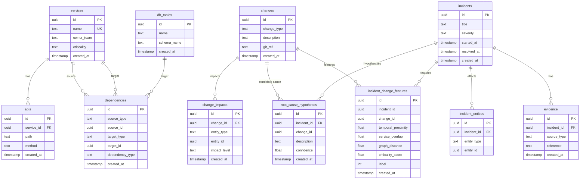
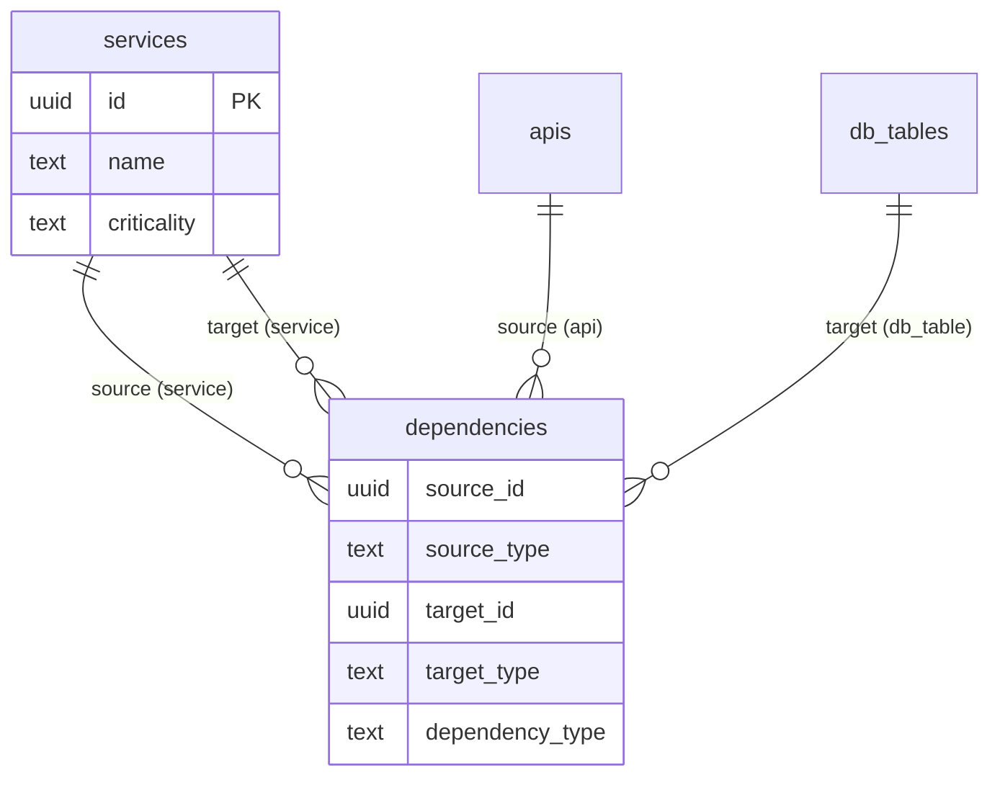
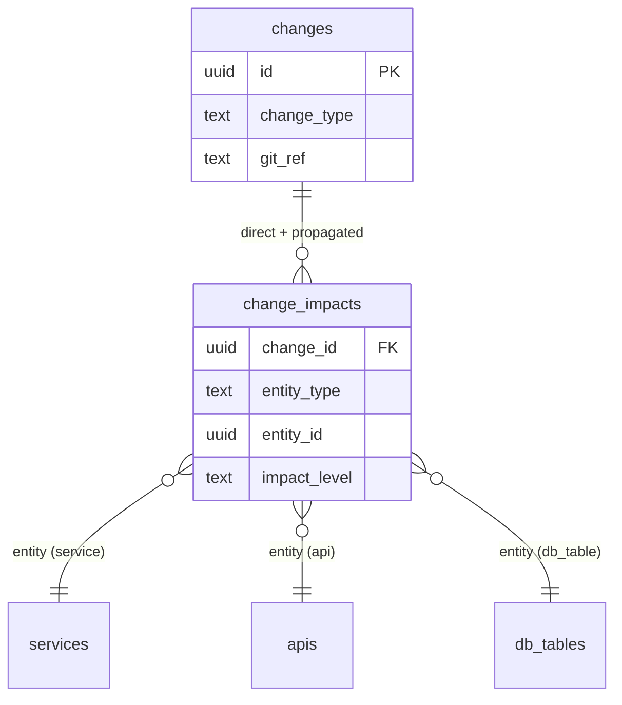
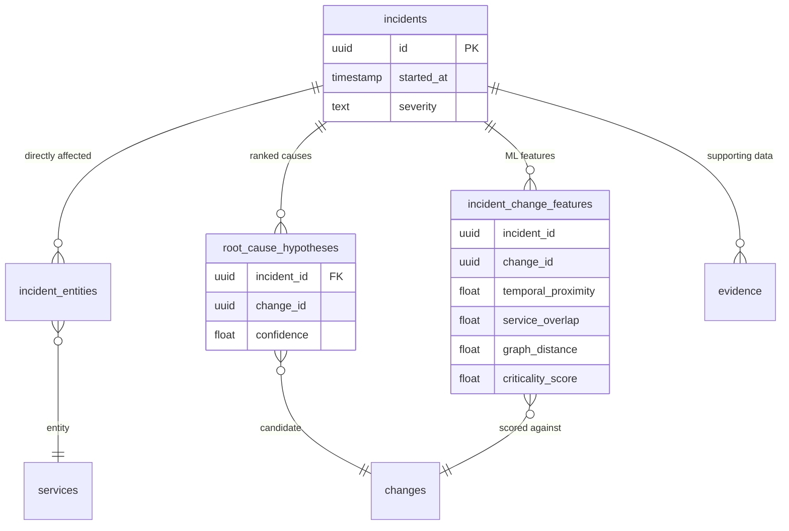

# DATABASE_ERD.md

**Database:** PostgreSQL 15 (`srci`)  
**Domain:** System Reliability & Change Intelligence

---

## Entity Relationship Explanation

SRCI models a **dependency graph** of engineering services connected by directed edges. Changes propagate impact through this graph. Incidents attach to affected services, and the system correlates incidents with recent changes to produce ranked root-cause hypotheses. ML features capture the statistical relationship between incident–change pairs.

### Core Entity Groups

| Group | Tables | Role |
|-------|--------|------|
| **Service Catalog** | `services`, `apis`, `db_tables` | Registry of system components |
| **Graph** | `dependencies` | Directed edges between components |
| **Change Domain** | `changes`, `change_impacts` | Change events and blast radius |
| **Incident Domain** | `incidents`, `incident_entities`, `evidence` | Failure events and supporting data |
| **Intelligence** | `root_cause_hypotheses`, `incident_change_features` | Correlation output and ML features |

### Relationship Types

| Type | Example | Mechanism |
|------|---------|-----------|
| **Direct FK** | `apis.service_id → services.id` | Enforced in DDL |
| **Polymorphic** | `dependencies.source_id` | Application-level resolution via `source_type` |
| **Logical FK** | `root_cause_hypotheses.change_id → changes.id` | Joined in Python, not enforced |
| **Junction (implicit)** | `incident_change_features` | Links incidents to changes with computed features |

---

## Parent / Child Table Map

| Parent | Child | Relationship | FK Enforced |
|--------|-------|--------------|-------------|
| `services` | `apis` | 1:N | Yes |
| `services` | `dependencies` (as source/target) | 1:N polymorphic | No |
| `db_tables` | `dependencies` (as target) | 1:N polymorphic | No |
| `changes` | `change_impacts` | 1:N | Yes |
| `incidents` | `incident_entities` | 1:N | Yes |
| `incidents` | `root_cause_hypotheses` | 1:N | Yes |
| `incidents` | `evidence` | 1:N | Yes |
| `incidents` | `incident_change_features` | 1:N | No |
| `changes` | `incident_change_features` | 1:N | No |
| `changes` | `root_cause_hypotheses` | 1:N | No |

---

## Full Entity Relationship Diagram

---

## Dependency Graph Sub-Diagram

The dependency graph is the central structural element. Edges are polymorphic but current ingestion only creates `service → service` edges.

**Graph Semantics:**

- `source_id` depends on `target_id` (source calls/consumes target)
- Impact propagation walks from target → source (downstream callers)
- Graph traversal for RCA expands affected services downstream

---

## Change Impact Flow Diagram

**Impact Levels:**

- `high` — directly touched by change
- `medium` — one hop downstream in dependency graph
- `low` — two or more hops downstream

---

## Incident Correlation Flow Diagram

---

## Polymorphic Entity Resolution

Several tables use a `(entity_type, entity_id)` pattern without database-level FK enforcement:

| Table | entity_type Values | Resolves To |
|-------|-------------------|-------------|
| `dependencies` | `source_type`: service, api | `services`, `apis` |
| `dependencies` | `target_type`: service, db_table | `services`, `db_tables` |
| `change_impacts` | service, api, db_table | `services`, `apis`, `db_tables` |
| `incident_entities` | service, api, db_table | `services`, `apis`, `db_tables` |

This design allows graph flexibility but creates **referential integrity risk** — orphaned UUIDs are possible if entities are deleted without cascade cleanup.
