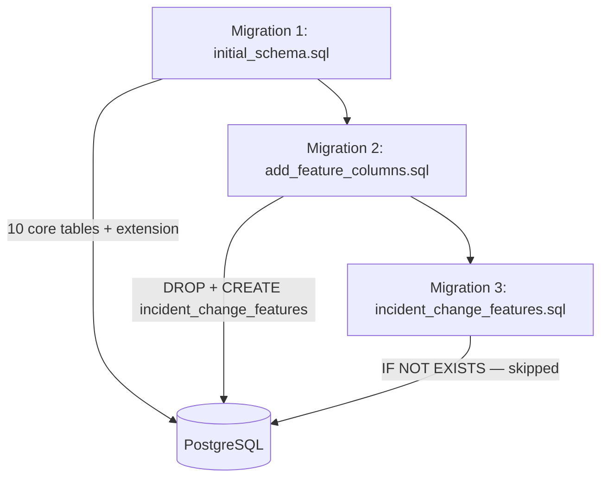

# MIGRATION_AUDIT.md

**Migration Runner:** `scripts/run_migrations.sh`  
**Migration Tool:** Raw `psql` (no Alembic, Flyway, or versioning table)  
**Database:** PostgreSQL 15

---

## Migration Timeline

| Order | File | Approx. Purpose | Action Type |
|------:|------|-----------------|-------------|
| 1 | `initial_schema.sql` | Base schema v1 | CREATE |
| 2 | `add_feature_columns.sql` | ML feature table | DROP + CREATE |
| 3 | `incident_change_features.sql` | Alternate ML feature table | CREATE IF NOT EXISTS (no-op) |

---

## Migration 1: `initial_schema.sql`

### Creates

| Object | Type | Details |
|--------|------|---------|
| `uuid-ossp` | Extension | UUID generation |
| `services` | Table | Service registry with criticality CHECK |
| `apis` | Table | API metadata with FK to services |
| `db_tables` | Table | Database table metadata |
| `dependencies` | Table | Polymorphic dependency graph edges |
| `changes` | Table | Change events |
| `change_impacts` | Table | Change-to-entity impact mapping |
| `incidents` | Table | Incident records |
| `incident_entities` | Table | Incident-to-entity links |
| `root_cause_hypotheses` | Table | RCA hypothesis storage |
| `evidence` | Table | Incident evidence |

### Modifies

| Object | Change |
|--------|--------|
| `root_cause_hypotheses` | `ALTER TABLE ADD COLUMN change_id UUID` (no FK, no NOT NULL) |

### Dependencies

- Requires PostgreSQL with `uuid-ossp` extension support
- No prior migrations required (first in chain)

### Idempotency

Uses `CREATE TABLE IF NOT EXISTS` and `CREATE EXTENSION IF NOT EXISTS` — safe to re-run table creation, but `ALTER TABLE ADD COLUMN change_id` will fail on second run if column already exists.

---

## Migration 2: `add_feature_columns.sql`

### Creates

| Object | Type | Details |
|--------|------|---------|
| `incident_change_features` | Table | ML feature store with 5 feature columns |

### Modifies

| Object | Change |
|--------|--------|
| `incident_change_features` | `DROP TABLE IF EXISTS` then full CREATE |

### Schema Created

```sql
incident_change_features (
    id UUID PRIMARY KEY,
    incident_id UUID,
    change_id UUID,
    temporal_proximity FLOAT,
    service_overlap FLOAT,
    graph_distance FLOAT,
    criticality_score FLOAT,
    label INTEGER,
    created_at TIMESTAMP DEFAULT NOW()
)
```

### Dependencies

- Requires Migration 1 complete (incidents and changes tables exist logically, though no FK enforced)

### Idempotency

**Destructive on re-run:** `DROP TABLE IF EXISTS` wipes all feature data before recreating.

---

## Migration 3: `incident_change_features.sql`

### Creates

| Object | Type | Details |
|--------|------|---------|
| `incident_change_features` | Table | Alternate schema with different columns |

### Alternate Schema (never applied on fresh install)

```sql
incident_change_features (
    id UUID PRIMARY KEY,
    incident_id UUID NOT NULL,
    change_id UUID NOT NULL,
    impact_score FLOAT,
    graph_distance INT,
    time_delta_hours FLOAT,
    evidence_count INT,
    label INT,
    created_at TIMESTAMP DEFAULT NOW()
)
```

### Dependencies

- Runs after Migration 2

### Idempotency

`CREATE TABLE IF NOT EXISTS` — **no-op** because Migration 2 already created the table. This migration is effectively dead code on fresh installs.

---

## Dependency Chain



---

## Schema Evolution Summary

| Phase | State |
|-------|-------|
| After Migration 1 | 10 core tables + extension; hypotheses has `change_id` column |
| After Migration 2 | 11 tables; `incident_change_features` with ML columns (authoritative) |
| After Migration 3 | No change (table already exists) |

---

## Potential Conflicts

| Conflict | Severity | Detail |
|----------|----------|--------|
| **Conflicting feature table schemas** | **Critical** | Migrations 2 and 3 define different column sets for `incident_change_features`. Application code uses Migration 2 schema exclusively. |
| **`ALTER TABLE` not idempotent** | High | Re-running Migration 1 fails on `ADD COLUMN change_id` if column exists |
| **No migration versioning** | High | No `schema_migrations` table; re-runs are partially safe but destructive for features |
| **No rollback scripts** | High | No DOWN migrations exist |
| **`PROPAGATING_DEPENDENCIES` typo in compose** | Medium | `docker-compose.yml` sets `runtine` on `db` service (wrong service, wrong spelling) |

---

## Potential Rollback Risks

| Scenario | Risk | Impact |
|----------|------|--------|
| Re-run all migrations | Data loss on `incident_change_features` | Migration 2 DROP TABLE destroys all ML features |
| Roll back Migration 2 only | No script exists | Manual `DROP TABLE incident_change_features` required |
| Roll back Migration 1 | No script exists | Would require dropping all 10+ tables manually |
| Partial migration failure | No transaction wrapping across files | Each `psql -f` runs independently; partial state possible if Migration 2 fails after Migration 1 succeeds |
| Production re-deploy | Migrations re-run on every container start | `CREATE IF NOT EXISTS` safe for tables; `DROP TABLE` in Migration 2 is **not safe** for production |

---

## Migration Runner Analysis

**File:** `scripts/run_migrations.sh`

```bash
psql "$DATABASE_URL" -f app/migrations/versions/initial_schema.sql
psql "$DATABASE_URL" -f app/migrations/versions/add_feature_columns.sql
psql "$DATABASE_URL" -f app/migrations/versions/incident_change_features.sql
```

| Property | Assessment |
|----------|------------|
| Ordering | Fixed, explicit — correct |
| Version tracking | None |
| Idempotency | Partial — Migration 2 is destructive |
| Error handling | `set -e` — stops on first failure |
| Wait logic | Polls Postgres until ready |
| Working directory | Assumes `/app` (Docker WORKDIR) |

---

## Recommendations (Documentation Only)

1. **Remove or reconcile** `incident_change_features.sql` — it creates schema drift confusion
2. **Add migration versioning table** to track applied migrations
3. **Make Migration 2 non-destructive** — use `ALTER TABLE ADD COLUMN IF NOT EXISTS` instead of DROP + CREATE
4. **Add idempotent ALTER** for `change_id` column: `ADD COLUMN IF NOT EXISTS`
5. **Create rollback scripts** for each migration
6. **Do not re-run Migration 2 in production** without data backup
