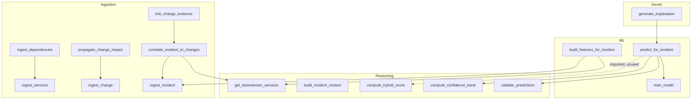

# PROCEDURE_AUDIT.md

**Scope:** Stored procedures, functions, and reusable logic units  
**Database:** PostgreSQL 15 (`srci`)

---

## Executive Summary

**No database-side stored procedures or user-defined functions exist in this repository.**

All business logic is implemented in **Python application modules** using embedded SQL via `psycopg2`. The audit below documents these Python "procedure equivalents" and identifies dead, unused, and duplicate logic.

---

## Database Objects

| Object Type | Count | Status |
|-------------|-------|--------|
| Stored Procedures | 0 | None defined |
| User-Defined Functions | 0 | None defined |
| Triggers | 0 | None defined |
| Database Views | 0 | None defined |

**Built-in functions used:**

- `uuid_generate_v4()` — from `uuid-ossp` extension
- `NOW()` — PostgreSQL built-in

---

## Python Procedure Equivalents

### Ingestion Procedures

| Function | File | Inputs | Outputs | Side Effects |
|----------|------|--------|---------|--------------|
| `ingest_services(db_url)` | `service_ingestor.py` | DB URL | None | INSERT into `services` |
| `ingest_dependencies(db_url)` | `dependency_ingestor.py` | DB URL | None | INSERT into `dependencies` |
| `ingest_change(db_url, change_type, description, git_ref, services_touched)` | `change_ingestor.py` | Change metadata + service names | `change_id` | INSERT into `changes`, `change_impacts` |
| `ingest_incident(db_url, title, severity, started_at, affected_services)` | `incident_ingestor.py` | Incident metadata + service names | `incident_id` | INSERT into `incidents`, `incident_entities` |
| `propagate_change_impact(db_url, change_id)` | `impact_propagator.py` | Change ID | None | INSERT into `change_impacts` (BFS) |
| `correlate_incident_to_changes(db_url, incident_id)` | `incident_change_correlator.py` | Incident ID | List of (change_id, confidence) | DELETE + INSERT into `root_cause_hypotheses` |
| `link_change_evidence(db_url, incident_id)` | `evidence_linker.py` | Incident ID | None | DELETE + INSERT into `evidence` |

### Reasoning Procedures

| Function | File | Inputs | Outputs | Side Effects |
|----------|------|--------|---------|--------------|
| `get_downstream_services(conn, service_ids)` | `graph_traversal.py` | Connection, service UUID set | Expanded UUID set | Read-only |
| `build_incident_context(db_url, incident_id)` | `context_builder.py` | Incident ID | JSON context dict | Read-only |
| `compute_hybrid_score(rule_confidence, ml_probability, ...)` | `hybrid_scorer.py` | Scores + reliability params | Float hybrid score | Read-only |
| `compute_confidence_band(hybrid_score)` | `confidence_band.py` | Hybrid score | Band string | Read-only |
| `validate_predictions(predictions)` | `rca_guardrails.py` | Prediction list | Cleaned list | Read-only |
| `detect_weak_signal(candidates)` | `rca_guardrails.py` | Candidate list | Boolean | Read-only |
| `detect_close_competition(candidates)` | `rca_guardrails.py` | Candidate list | Boolean | Read-only |

### ML Procedures

| Function | File | Inputs | Outputs | Side Effects |
|----------|------|--------|---------|--------------|
| `build_features_for_incident(db_url, incident_id)` | `feature_builder.py` | Incident ID | None | DELETE + INSERT into `incident_change_features` |
| `train_model(db_url)` | `train_model.py` | DB URL | Metrics dict | Writes `model.joblib` |
| `predict_for_incident(db_url, incident_id)` | `predictor.py` | Incident ID | Predictions dict | Read-only (loads model) |

### GenAI Procedures

| Function | File | Inputs | Outputs | Side Effects |
|----------|------|--------|---------|--------------|
| `generate_explanation(context)` | `explainer.py` | Context dict | Markdown string | Read-only (Groq unused) |

---

## Dead / Unused Logic

| Function/Module | Status | Detail |
|-----------------|--------|--------|
| `compute_hybrid_score()` in `hybrid_scorer.py` | **Imported but bypassed** | `predictor.py` imports it but uses inline 0.6/0.4 weighting instead |
| `compute_ml_reliability()` | **Dead code path** | Only called by unused `compute_hybrid_score()` |
| `compute_rule_reliability()` | **Dead code path** | Only called by unused `compute_hybrid_score()` |
| Groq `client` in `explainer.py` | **Initialized but never called** | Template explanation returned instead |
| `EXPLANATION_PROMPT` in `explainer.py` | **Defined but unused** | LLM prompt never sent |
| `prompts.py` | **Entire module unused** | No imports found |
| `incident_change_features.sql` migration | **Dead migration** | No-op on fresh install due to IF NOT EXISTS |
| `apis` table | **Schema only** | No ingestion populates it |
| `db_tables` table | **Schema only** | No ingestion populates it |

---

## Duplicate Logic

| Logic | Locations | Divergence |
|-------|-----------|------------|
| Incident + affected services query | `context_builder.py`, `explain.py`, `feature_builder.py`, `incident_change_correlator.py` | Same query, 4 copies |
| Features ↔ hypotheses JOIN | `context_builder.py`, `predictor.py` | Same join, different columns |
| Evidence SELECT | `context_builder.py`, `explain.py` | Identical |
| Graph downstream traversal | `graph_traversal.py`, `impact_propagator.py` | **Different filters and semantics** |
| Hybrid scoring | `hybrid_scorer.py` vs inline in `predictor.py` | Reliability calibration exists but bypassed |
| Criticality weight mapping | `feature_builder.py` (SQL CASE), `incident_change_correlator.py` (Python dict) | Parallel scoring models |
| DELETE-then-INSERT idempotency | `feature_builder.py`, `incident_change_correlator.py`, `evidence_linker.py` | Same pattern, 3 copies |
| Debug trace building | `explain.py` (`build_debug_trace`) | Could be shared utility |

---

## Dependency Graph

---

## Side Effects Summary

| Procedure | Writes To | Deletes From | External I/O |
|-----------|-----------|--------------|--------------|
| `ingest_services` | `services` | — | Filesystem YAML |
| `ingest_dependencies` | `dependencies` | — | Filesystem YAML |
| `ingest_change` | `changes`, `change_impacts` | — | — |
| `ingest_incident` | `incidents`, `incident_entities` | — | — |
| `propagate_change_impact` | `change_impacts` | — | — |
| `correlate_incident_to_changes` | `root_cause_hypotheses` | `root_cause_hypotheses` | — |
| `link_change_evidence` | `evidence` | `evidence` (change type) | — |
| `build_features_for_incident` | `incident_change_features` | `incident_change_features` | — |
| `train_model` | — | — | `model.joblib` file |
| All others | — | — | — |

---

## Recommendations (Documentation Only)

1. **Consolidate** incident context queries into single `context_builder.py` used by all consumers
2. **Activate or remove** `compute_hybrid_score()` — currently dead import
3. **Activate or remove** Groq LLM integration — currently requires API key but returns template
4. **Remove** `prompts.py` if LLM integration is deferred
5. **Unify** graph traversal between `graph_traversal.py` and `impact_propagator.py`
6. **Consider moving** high-value logic (graph traversal, feature computation) into PostgreSQL functions for performance and reuse
