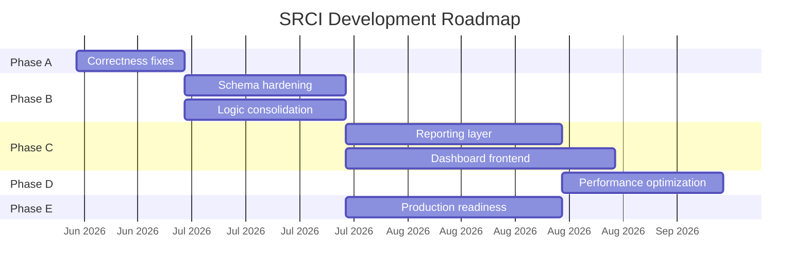

# SRCI_ROADMAP.md

> **Superseded for day-to-day development.** Use the living roadmap: **[`docs/ROADMAP.md`](../ROADMAP.md)**  
> This file is a static audit snapshot from 2026-06-20.

**Generated:** 2026-06-20  
**Based on:** Complete project audit findings

---

## Phase A — Immediate Work Required

**Goal:** Fix correctness blockers in the RCA pipeline  
**Timeline Estimate:** 1–2 sprints  
**Complexity:** Medium  
**Risk:** Low (isolated fixes)

| # | Task | Dependencies | Risk | Priority |
|---|------|--------------|------|----------|
| A1 | **Fix `dependency_type` on ingest** — set default `'runtime'` in `dependency_ingestor.py` | None | Low | P0 |
| A2 | **Fix evidence reference mismatch** — align correlator and linker reference formats | None | Low | P0 |
| A3 | **Fix correlator time window** — add upper bound `AND created_at <= incident_started_at` | None | Low | P0 |
| A4 | **Reconcile feature table migrations** — remove or merge `incident_change_features.sql` | None | Low | P1 |
| A5 | **Create root README + `.env.example`** | None | Low | P1 |
| A6 | **Fix docker-compose typo** — move `PROPAGATING_DEPENDENCIES` to backend service, fix `runtime` | None | Low | P2 |

**Recommended Order:** A1 → A2 → A3 → A4 → A5 → A6

---

## Phase B — Core Business Logic Completion

**Goal:** Complete the RCA pipeline with correct, consolidated logic  
**Timeline Estimate:** 2–3 sprints  
**Complexity:** High  
**Risk:** Medium (touches core scoring logic)

| # | Task | Dependencies | Risk | Priority |
|---|------|--------------|------|----------|
| B1 | **Add database indexes** — `changes(created_at)`, `change_impacts(change_id)`, `dependencies(target_id)`, `incident_entities(incident_id)`, `root_cause_hypotheses(incident_id, change_id)` | Phase A complete | Low | P0 |
| B2 | **Add FK constraints** — `incident_change_features`, `root_cause_hypotheses.change_id` | Phase A complete | Medium (existing data) | P0 |
| B3 | **Add unique constraints** — `(incident_id, change_id)` on features/hypotheses; `(change_id, entity_id)` on impacts | B1 | Medium | P1 |
| B4 | **Consolidate context builder** — single module used by explain, reasoning, features | None | Low | P1 |
| B5 | **Activate `compute_hybrid_score()`** — replace inline weights in predictor | None | Medium (scoring change) | P1 |
| B6 | **Unify graph traversal** — single module with consistent filters for propagation and RCA | A1 | Medium | P1 |
| B7 | **Implement label assignment pipeline** — API or manual process to set positive ML labels | B1 | Medium | P1 |
| B8 | **Batch SQL refactor** — replace N+1 loops with set-based queries in feature_builder and correlator | B1 | Medium | P2 |
| B9 | **Centralize scoring weights** — config file or database table for all hardcoded thresholds | None | Low | P2 |
| B10 | **Add migration versioning** — `schema_migrations` table + idempotent alters | A4 | Low | P2 |

**Recommended Order:** B1 → B2 → B3 → B4 → B5 → B6 → B7 → B8 → B9 → B10

---

## Phase C — Reporting Layer

**Goal:** Build dashboard and reporting capabilities  
**Timeline Estimate:** 3–4 sprints  
**Complexity:** High  
**Risk:** Medium (new frontend stack decisions)

| # | Task | Dependencies | Risk | Priority |
|---|------|--------------|------|----------|
| C1 | **Create database views** — incident summary, change impact summary, dependency graph | Phase B | Low | P1 |
| C2 | **Add pagination to list APIs** — services, changes, dependencies, hypotheses | None | Low | P1 |
| C3 | **Implement orchestrated RCA workflow** — single endpoint: correlate → features → evidence → predict | Phase B | Medium | P1 |
| C4 | **Activate Groq LLM explanation** — wire `client.chat.completions.create()` in explainer | None | Medium | P2 |
| C5 | **Build dashboard frontend** — per `docs/03_modules/dashboard.md` spec | C1, C2 | High (stack choice) | P1 |
| C6 | **Dependency graph visualization** — interactive graph component | C5 | Medium | P2 |
| C7 | **Change impact report UI** — visual blast radius display | C5 | Medium | P2 |
| C8 | **Incident investigation UI** — hypothesis ranking, evidence chain, explanation | C5, C3 | Medium | P2 |

**Recommended Order:** C1 → C2 → C3 → C5 → C6 → C7 → C8 → C4

---

## Phase D — Optimization

**Goal:** Performance, scalability, and code quality  
**Timeline Estimate:** 2–3 sprints  
**Complexity:** Medium  
**Risk:** Low–Medium

| # | Task | Dependencies | Risk | Priority |
|---|------|--------------|------|----------|
| D1 | **Move graph traversal to PostgreSQL function** — recursive CTE for downstream services | Phase B | Medium | P2 |
| D2 | **Connection pooling** — pgBouncer or psycopg2 pool | None | Low | P1 |
| D3 | **Add structured logging** — request tracing, query timing | None | Low | P1 |
| D4 | **Materialized views for dashboard aggregates** — refresh on ingest | Phase C | Low | P2 |
| D5 | **Replace DELETE-then-INSERT with UPSERT** — preserve mapping history | Phase B | Medium | P2 |
| D6 | **Add input validation** — Pydantic models for all API inputs | None | Low | P1 |
| D7 | **Implement real Git ingestion** — clone repos, parse dependencies from code | None | High | P3 |

**Recommended Order:** D2 → D3 → D6 → D1 → D4 → D5 → D7

---

## Phase E — Production Readiness

**Goal:** Security, testing, CI/CD, and deployment  
**Timeline Estimate:** 2–3 sprints  
**Complexity:** Medium  
**Risk:** Low (standard practices)

| # | Task | Dependencies | Risk | Priority |
|---|------|--------------|------|----------|
| E1 | **Test suite** — unit tests for scoring, integration tests for API pipeline | Phase B | Low | P0 |
| E2 | **CI/CD pipeline** — GitHub Actions: lint, test, build, push | E1 | Low | P0 |
| E3 | **Authentication** — API key or OAuth for endpoints | None | Medium | P1 |
| E4 | **Production Docker Compose** — no `--reload`, health checks, resource limits | None | Low | P1 |
| E5 | **Database backup strategy** — pg_dump schedule, restore procedure | None | Low | P1 |
| E6 | **Monitoring** — Prometheus metrics, health dashboards | D3 | Low | P2 |
| E7 | **Rate limiting** — protect against abuse | E3 | Low | P2 |
| E8 | **Secrets management** — vault or env injection for production | E4 | Medium | P2 |

**Recommended Order:** E1 → E2 → E3 → E4 → E5 → E6 → E7 → E8

---

## Timeline Overview

---

## Risk Summary

| Phase | Overall Risk | Key Risk |
|-------|-------------|----------|
| A | Low | Correctness bugs affect RCA accuracy |
| B | Medium | Scoring changes may alter existing results |
| C | Medium–High | Frontend stack selection, LLM integration cost |
| D | Low–Medium | PostgreSQL function migration complexity |
| E | Low | Standard engineering practices |

---

## Success Criteria by Phase

| Phase | Done When |
|-------|-----------|
| A | All 3 correctness bugs fixed; README exists |
| B | Indexes and FKs in place; single context builder; hybrid scorer active; labels assignable |
| C | Dashboard renders dependency graph, change impact, and incident RCA; orchestrated workflow endpoint works |
| D | Graph traversal <100ms for 1000 services; connection pooling active; structured logs |
| E | 80%+ test coverage; CI green; auth enabled; production compose deployed |
